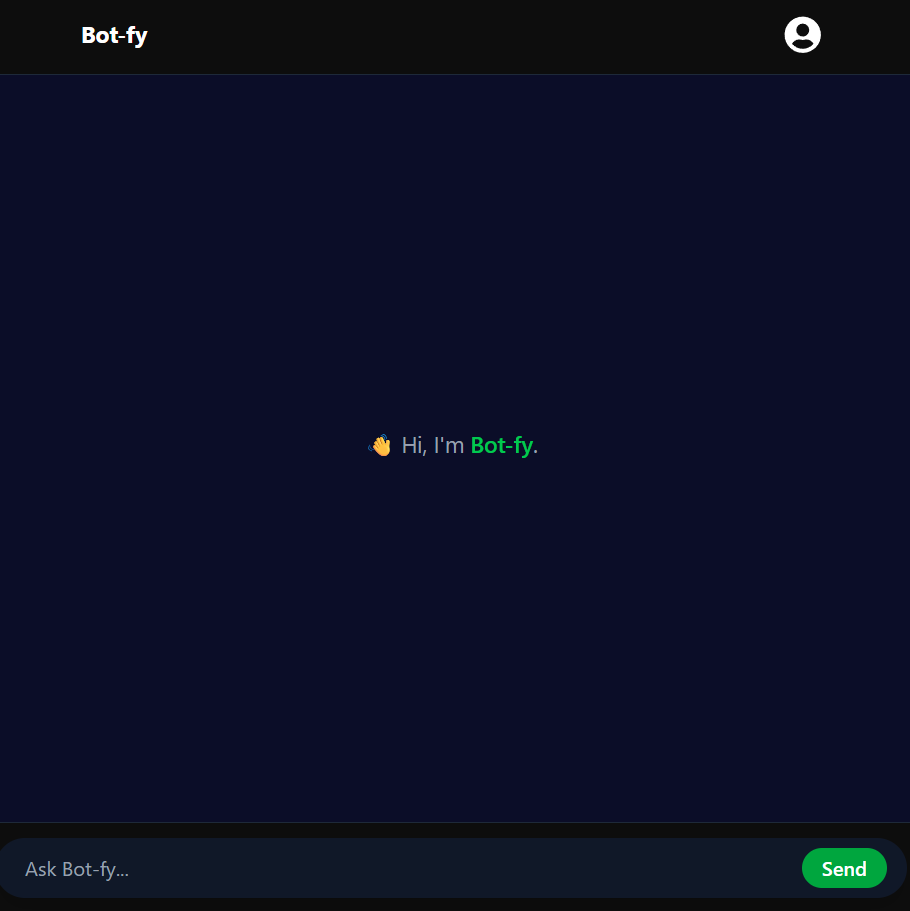

🤖 Bot-fy – Full Stack Chatbot Application

Bot-fy is a modern full-stack chatbot web application built using React, Node.js, Express, and MongoDB. The project demonstrates smooth frontend–backend integration, real-time chat interaction, and a clean, responsive UI.

🚀 Features

💬 Real-time user–bot conversation

⚡ Fast and responsive UI built with React + Tailwind CSS

🔄 Auto-scroll to latest messages

🌐 Secure API communication using Axios & CORS

🗂 MongoDB for data persistence

🔐 Clean and scalable backend architecture

🛠 Tech Stack
Frontend

React (Vite)

Tailwind CSS

Axios

Backend

Node.js

Express.js

MongoDB (Mongoose)

CORS

dotenv

 
 